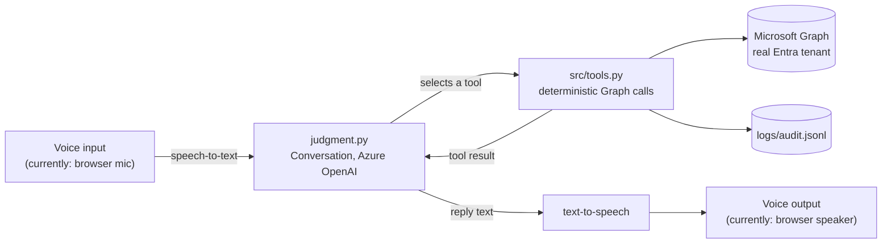

# SSPR Voice Agent

A voice-verified, AI-judged password reset agent for Microsoft Entra ID —
built as a companion to
[entra-automation-agent](https://github.com/vaibhavmahna/entra-automation-agent),
but kept as its own project since password reset is a distinct concern with
its own identity-verification problem to solve.

## The problem

Someone calls the helpdesk because they've forgotten their password. Over the
phone, a confident voice is the only thing being checked — the exact failure
mode behind real breaches like MGM Resorts/Caesars in 2023. Knowledge-based
questions (mother's maiden name, employee ID) are just as spoofable. The
right answer is to verify through something the caller already has, not
something they can say.

## How it verifies identity

Instead of trusting anything spoken on the call, this agent:

1. Looks up the caller's real, registered recovery contact in Entra
   (`authentication/emailMethods` / `phoneMethods` — the actual objects
   behind Microsoft's own SSPR, not the unverified `otherMails`/`mobilePhone`
   profile fields, which Microsoft is retiring from SSPR entirely as of
   September 2026).
2. Generates a one-time numeric code and delivers it only to that
   already-registered contact — never spoken aloud, never sent anywhere
   unverified.
3. Only resets the password once the caller reads that code back correctly.

No knowledge-based questions. Nothing the caller says is trusted until it's
proven by something only the real account owner could have received.

## Architecture



`judgment.py`'s `Conversation` class is front-end-agnostic — it takes caller
text one turn at a time and returns the agent's reply, with no idea whether
that text came from a keyboard or a speech transcript. `web_api.py` (FastAPI)
wraps it for the browser; `main_password_reset.py` exercises the same
deterministic tools without any LLM, for testing the core actions in
isolation.

## What's built

- **Deterministic core** (`src/tools.py`, `src/notify.py`) — recovery-contact
  lookup, one-time code generation, email delivery, password reset. Nothing
  here is probabilistic.
- **LLM judgment layer** (`judgment.py`) — decides how to handle each call:
  which channel to verify through, whether to escalate, when to actually
  reset. Same deterministic-core-plus-judgment-layer split as
  `entra-automation-agent`.
- **Voice front end** (`web_api.py` + `web/index.html`) — a voice input/output
  layer talking to the judgment layer one turn at a time over a small
  FastAPI backend. Currently a browser microphone and speaker via Azure AI
  Speech SDK, but `Conversation.process_turn()` just takes text in and
  returns text out - it has no idea the input came from a browser, so this
  input source is swappable (a different STT/TTS provider, a different
  client entirely) without touching the judgment layer at all. No
  telephony, no Azure Communication Services phone number, no
  organizational-verification bottleneck.

## Setup

```bash
python3 -m venv .venv
source .venv/bin/activate
pip install -r requirements.txt
cp .env.example .env
```

The app registration in `.env` needs these Microsoft Graph **Application**
permissions, with admin consent granted:

- `UserAuthMethod-Email.Read.All`
- `UserAuthMethod-Phone.Read.All`
- `UserAuthenticationMethod.ReadWrite.All`
- `User-PasswordProfile.ReadWrite.All`

Plus the **Password Administrator** directory role assigned to the app's
service principal (the least-privileged role for this — it can't reset
passwords for Helpdesk/User/Global Administrator accounts). App-only
(client-credentials) calls to the password-reset endpoint may additionally
require **User Administrator** — worth confirming against your own tenant
before assuming Password Administrator alone is enough.

A separate app registration (`MAIL_*` in `.env`) sends the notification
email, same pattern as `entra-automation-agent`'s mailbox connector —
`Mail.Send`, scoped to one mailbox via an Exchange Application Access Policy.

`DEFAULT_DOMAIN` is the tenant domain appended to a bare username (see
below for why). `SPEECH_KEY`/`SPEECH_REGION` are from an Azure AI Speech
resource (F0 free tier is enough for this).

## Usage

Deterministic core only, no LLM (for testing the actions in isolation):

```bash
python main_password_reset.py someone@yourtenant.onmicrosoft.com              # dry run
python main_password_reset.py someone@yourtenant.onmicrosoft.com --execute    # actually perform it
```

Full conversation, text-only, at the terminal:

```bash
python judgment.py
```

Full voice demo, in a browser:

```bash
python -m uvicorn web_api:app --port 8010
```

Then open `http://127.0.0.1:8010/` — **use Chrome**, not Safari (see below).

**Test against a disposable sandbox tenant first** — this genuinely sends
codes and resets real passwords.

## Deploying

Runs as a single Azure Function (Linux, Consumption plan) — the same
FastAPI app that serves the browser demo locally, just wrapped for Azure
Functions and serving both the static front end and the API from one
deployment. No separate Static Web App needed.

```bash
# Resource group, storage account, and the Function App itself
az group create --name <your-resource-group> --location <your-region>
az storage account create --name <your-storage-account> \
  --resource-group <your-resource-group> --location <your-region> --sku Standard_LRS
az functionapp create --name <your-function-app-name> \
  --resource-group <your-resource-group> --storage-account <your-storage-account> \
  --consumption-plan-location <your-region> --runtime python \
  --runtime-version 3.11 --functions-version 4 --os-type Linux

# Managed identity, so DefaultAzureCredential can reach Azure OpenAI with no key
az functionapp identity assign --name <your-function-app-name> --resource-group <your-resource-group>
az role assignment create --assignee <principal-id-from-above> \
  --role "Cognitive Services OpenAI User" --scope <your-azure-openai-resource-id>

# Every value from .env as an app setting
az functionapp config appsettings set --name <your-function-app-name> \
  --resource-group <your-resource-group> --settings GRAPH_TENANT_ID=... [...]
```

`function_app.py` wraps `web_api.py`'s FastAPI app with `func.AsgiFunctionApp`
(`http_auth_level=ANONYMOUS`, since the browser calls these endpoints
directly with no key). `host.json` sets `routePrefix: ""` so the routes
match exactly what's used locally. Deploy the zip directly via Kudu rather
than `az functionapp deployment source config-zip` if that command silently
no-ops (it did during this build) - `az rest`/`curl` against
`https://<app>.scm.azurewebsites.net/api/zipdeploy?isAsync=false` with an
ARM bearer token worked reliably instead.

A live instance of this exists for demo purposes but isn't linked here
deliberately - the API has no rate limiting or access control in front of
it yet, so the URL is only shared directly rather than published where it
could be found and hit by anyone.

## Real problems hit building this

- **A real Microsoft Temporary Access Pass turned out to be a bad fit for
  voice**, despite being the "correct," Microsoft-native mechanism. Live
  testing proved it decisively: a caller correctly read back every
  character of a TAP, including explicitly stating "lowercase f" for a
  specific letter, and verification still failed twice — once because the
  model didn't fully convert "at the rate" into `@` and left a stray space,
  once because it defaulted to uppercase despite the caller's explicit
  callout. Asking a probabilistic model to produce an exact-case,
  exact-symbol string from speech isn't a prompting problem, it's the wrong
  place to enforce exact formatting. Switched to a self-generated 6-digit
  numeric code instead — same security property (still delivered only to
  the already-registered contact, still one-time, still time-limited), just
  actually readable over a call. Losing "it's Microsoft's own TAP
  mechanism" as a talking point was a real trade-off, but one live testing
  made obviously worth it.
- **Even numeric codes need an echo-back step.** A different live test hit
  a genuine speech-to-text transcription error — a duplicated character
  (`e+d2db$5` came through as `e+d2ddb$5`) that had nothing to do with
  formatting. Fuzzy-matching around that would weaken the actual security
  check, so instead the agent now always repeats back what it understood
  and waits for the caller to confirm before spending a verification
  attempt on it — the same pattern real phone verification systems use.
- **Speech-to-text reliably mangles a spoken domain name.** Asking a caller
  to say their full UPN out loud (`snd-user1@company.onmicrosoft.com`) was
  a bad idea — "onmicrosoft.com" routinely came through as "on microsoft
  dot com" or similar. Callers are now only asked for their short username;
  the tenant's default domain is appended server-side instead.
- **Safari couldn't reliably reactivate the microphone for a second turn**
  in the same page session — the mic indicator simply never lit up again,
  with no error thrown. Chrome handled the same code without issue.
  Recreating the `SpeechRecognizer`/`SpeechSynthesizer` on every single turn
  made this worse (a mic teardown/setup race that made the SDK silently
  hang); creating them once per call and reusing them for every turn
  fixed the hang, but Chrome is still the recommended browser for this demo.
- **A pinned dependency had quietly drifted.** `entra-automation-agent`'s
  `requirements.txt` still said `openai==1.58.1`, but the actually-installed
  version had been upgraded to 2.48.0 at some point without updating the
  pin — and the Responses API this project depends on doesn't exist in
  1.58.1. Found by hitting `AttributeError: 'OpenAI' object has no attribute
  'responses'` and checking the real installed version rather than trusting
  the pin.

## Roadmap

- [ ] Deploy somewhere live (Azure Static Web Apps + Function, matching the
      main site's pattern) instead of running locally only
- [ ] Real telephony via Azure Communication Services - `Conversation.process_turn()`
      already takes text in and returns text out with no idea where it came
      from, so swapping the browser mic/speaker for an actual inbound phone
      number is a new front end, not a rework of the judgment layer itself

## License

MIT.
